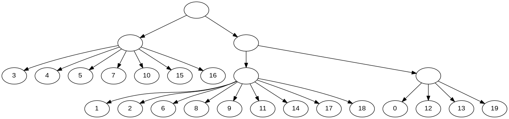
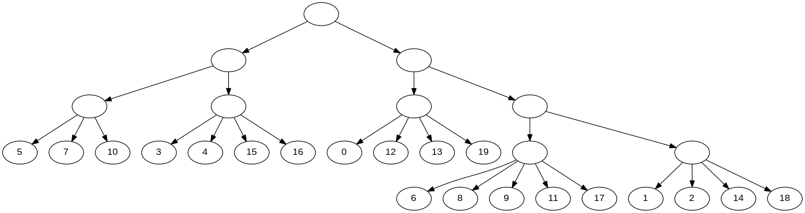
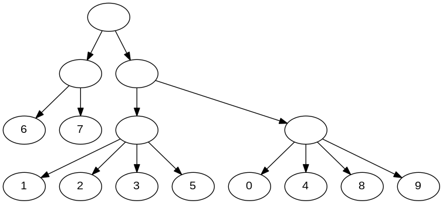
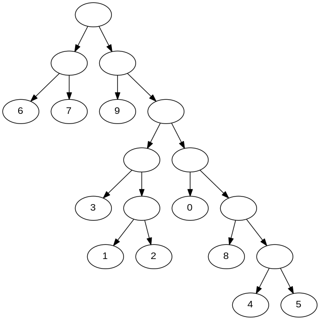

# qMAXRTC

Problem: given a set of triplets R and a parameter q, build a phylogenetic tree with exactly q internal nodes that contains the maximum number of triplets from R.

A sample generator for creating a set R is provided, as well as implementations of various approximations algorithms.

# Compilation

generator: g++ -O3 -std=c++11 -o generator generator.cpp

qmaxrtc: g++ -O3 -std=c++11 -o qmaxrtc main.cpp

# Creating Sample Inputs

type ./generator model[dc|noisy] n outputFile

dc: builds a random binary tree T with n leaves following the uniform model, extracts all the triplets from T and saves them in outputFile.

noisy: creates n^2 random triplets on a leaf label set of size n and saves the triplets in outputFile.

# Running qMAXRTC

type ./qmaxrtc q inputFile [dot|newick|both]

q: the number of desired internal nodes.

inputFile: the file containing the triplets. A triplet is described by three numbers x y z, which corresponds to the resolved rooted triplet xy|z. The program should work fine as long as numbers are used to for the leaf labels.

output format: the output of the tree with q internal nodes can be saved in both the newick and dot format.

# Examples

./generator dc 20 1.txt

./qmaxrtc 5 1.txt both

newick: ((3,4,5,7,10,15,16),((1,2,6,8,9,11,14,17,18),(0,12,13,19)));

Theoretical guarantee: 0.296296

Performance: 0.844737

./qmaxrtc 9 1.txt both

newick: (((5,7,10),(3,4,15,16)),((0,12,13,19),((6,8,9,11,17),(1,2,14,18))));

Theoretical guarantee: 0.32

Performance: 0.911404

./generator noisy 10 1.txt

./qmaxrtc 5 1.txt both

newick: ((6,7),((1,2,3,5),(0,4,8,9)));

Theoretical guarantee: 0.296296

Performance: 0.39

./qmaxrtc 9 1.txt both

newick: ((6,7),(9,((3,(1,2)),(0,(8,(4,5))))));

Theoretical guarantee: 0.32

Performance: 0.46

